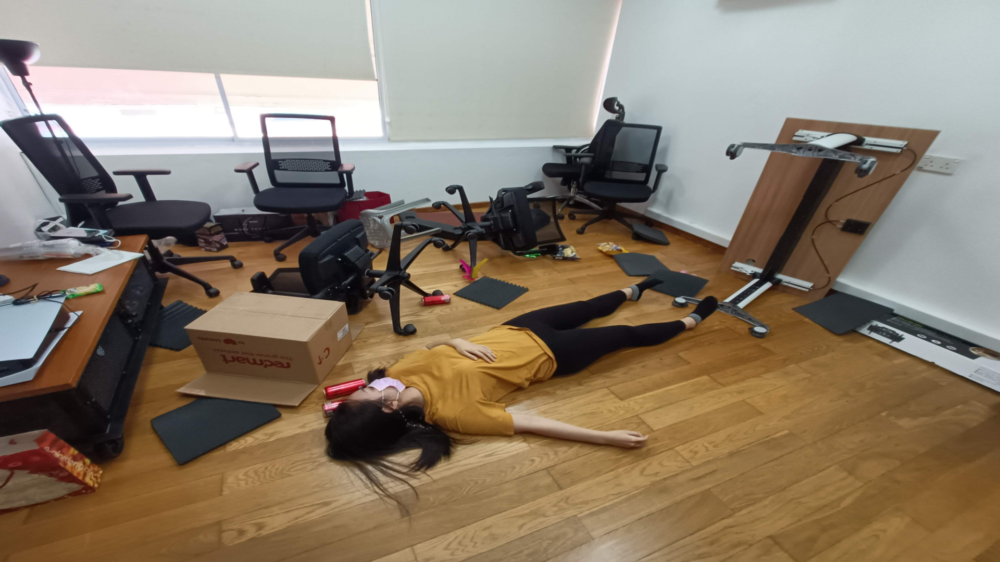
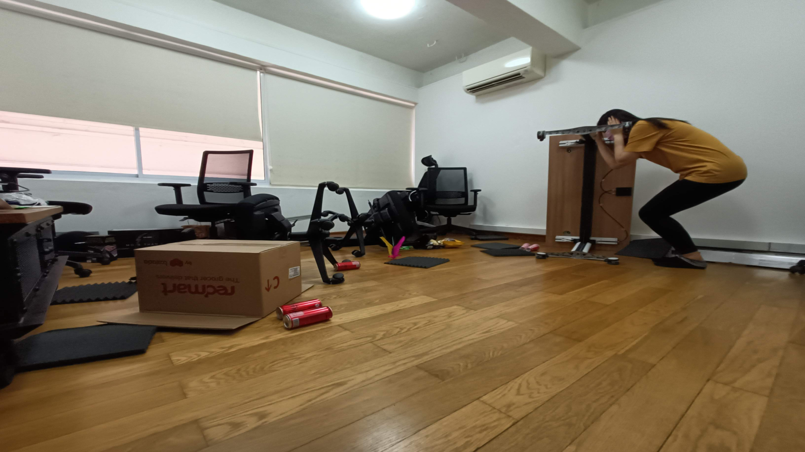
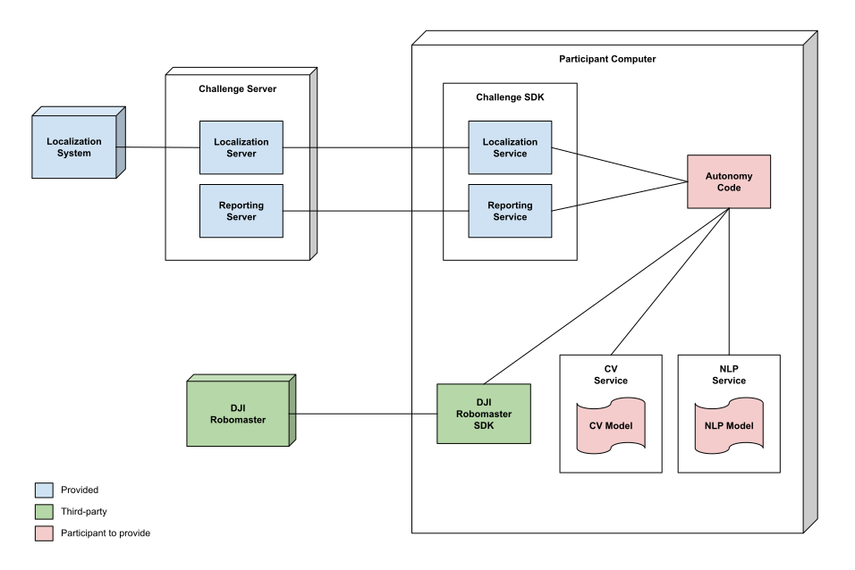

Challenge Details
=================

Challenge Task
~~~~~~~~~~~~~~

Your task is to develop code that will enable a SAR robot to autonomously
search a disaster site for human survivors and report high priority survirors
for extraction.

To do so you will need to accomplish the following subtasks:
1. Identify potential locations of interest
2. Plan a path to a location of interest
3. Navigate along the planned path

Human survivors are represented as image targets mounted on vertical surfaces
throughout the arena. These image targets will each display a human figure in 
poses, which can be classified into fallen or not fallen. Targets should be 
reported with the correct classification to assist rescuers in prioritizing
targets.

    Example of fallen target.

    Example of not fallen target.

Challenge Setup
~~~~~~~~~~~~~~~

.. _challenge-setup:

    
    Challenge setup

The above figure shows an overview of the Robotics Challenge setup.
A computer will be provided ("Participant Computer") on which to deploy
your code.

Services will be provided that enable you to interact with the robot and 
arena environment, as well as to report any targets identified. For
interacting with the robot the Robomaster SDK will be used directly. All other
services are served by one or more Challenge Servers and available as ReST
APIs. The Challenge SDK simplifies the use of these services by providing
an easy-to-use Python interface.

.. note::
    While you may use the ReST services directly this is strongly discouraged.
    For details on the provided services see :doc:`services`.

Your autonomy code will use the Robomaster SDK and should use the provided
Challenge SDK. Additionally you must provide the `CV Model` and `NLP Model`
from the earlier CV and NLP challenges. These models should be wrapped in the
provided `CV Service` and `NLP Service` interfaces to allow you to use the
provided mock modules (see :ref:`mocks`).

.. note::
    It is strongly recommended that your models be optimized and deployed 
    using an inference runtime as large unoptimized models may exhaust the
    compute resources on the computers used for the challenge.

    Details on how to do this with ONNX Runtime can be found in :doc:`models`.

Challenge Scoring
~~~~~~~~~~~~~~~~~

Scoring will be done using the :ref:`reporting-service`. Reports contain the
image seen by the robot and the detected target bounding box, and will be used
to confirm that the detected target is correct.

+----------------------------+--------+
| Item                       | Score  |
+============================+========+
| Missed Target              | 0      |
+----------------------------+--------+
| Correctly reported target  | 1      |
+----------------------------+--------+
| Misreported target         | 0.5    |
+----------------------------+--------+

You will be ranked based on your final score. Only the event of a tie, a tie-breaker
score will be calculated as follows:

.. code-block::

    score = number_of_reported_targets / (time_of_last_report - start_time)

The team with the higher tie-breaker score will be ranked higher.