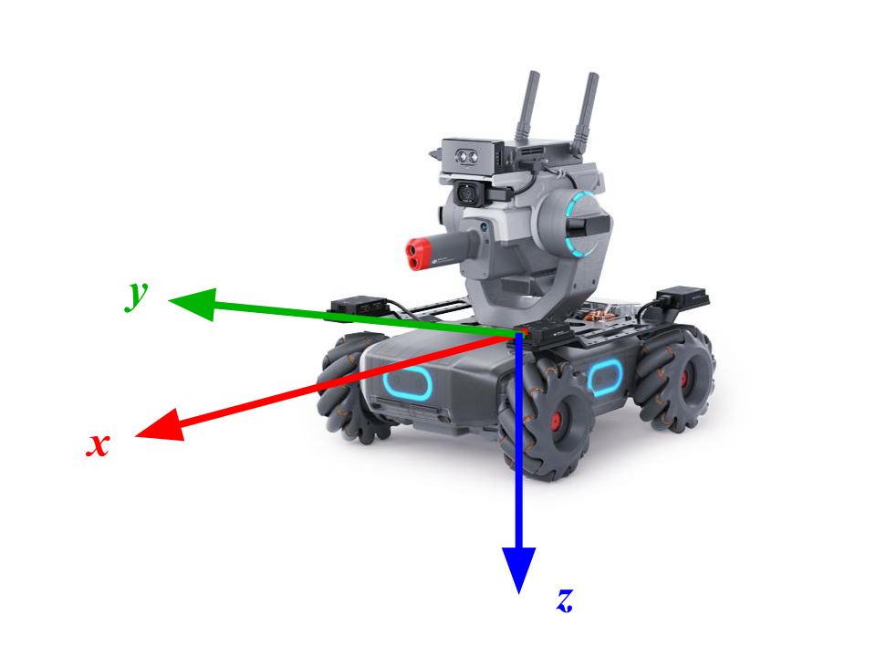

Definitions
===========

Reference frames
~~~~~~~~~~~~~~~~

The map/arena reference frame is right-handed, fixed to the arena with ``Z``-axis oriented
in the upwards direction.

The robot/body reference frame is right-handed, fixed to the robot body with origin
at the geometric center of the robot chassis, ``x``-axis in the forward longitudinal
direction of the robot chassis, ``z``-axis in the downwards direction.

.. figure:: _static/img/ref_frames.svg
    :width: 500px
    :align: center
    
    Reference frames used in challenge.

    Detail of body frame.

Location, Orientation & Pose
~~~~~~~~~~~~~~~~~~~~~~~~~~~~

A **location** is a 2-dimensional point on plane of the arena and is a 2-tuple.

**Orientation** (a.k.a. **heading**) is given in decimal degrees and is the angle 
between the body ``x``-axis and arena ``X``-axis measured from the arena ``X``-axis in
the positive arena ``Z``-direction (right-hand rule).

.. warning::
    The body frame ``z``-axis points downwards per the DJI Robomaster convention.
    Therefore a positive heading displacement in the arena frame is a negative 
    displacement in the body frame.

A **pose** is a 2-dimensional location and orientation, and is a 3-tuple. Keeping with 
the convention used in the DJI Robomaster SDK, heading angle is represented by the 
attribute/parameter ``z``.

All locations and poses are given in the arena frame.

All values used with the Robomaster SDK are in the body frame.